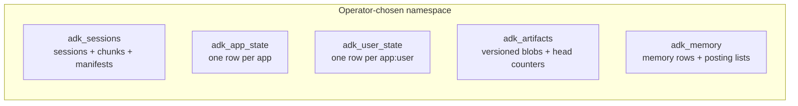
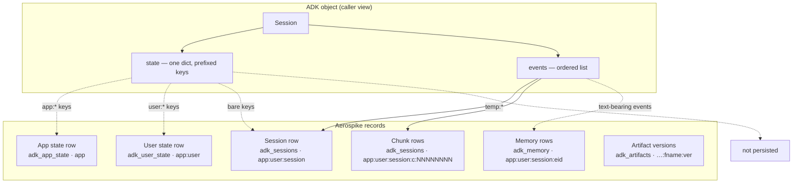
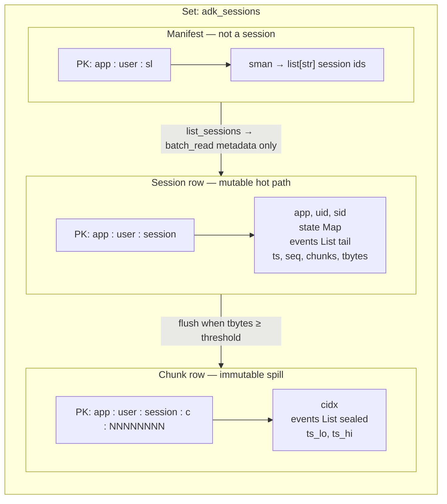
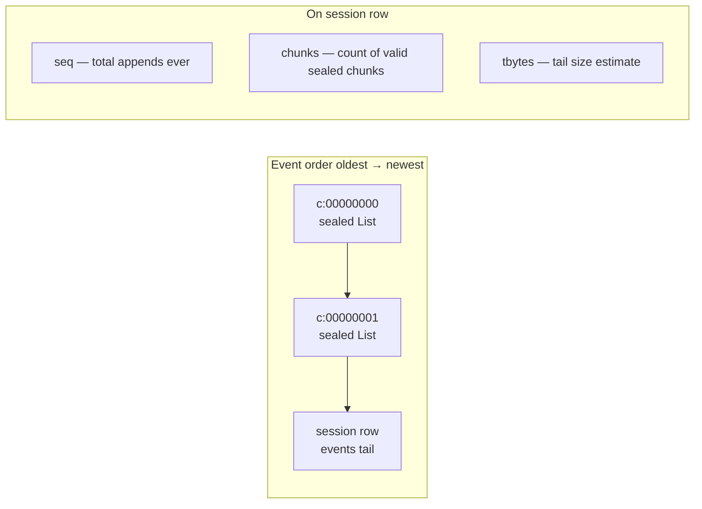
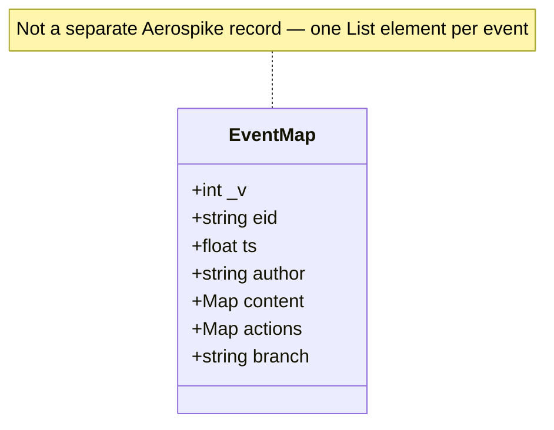
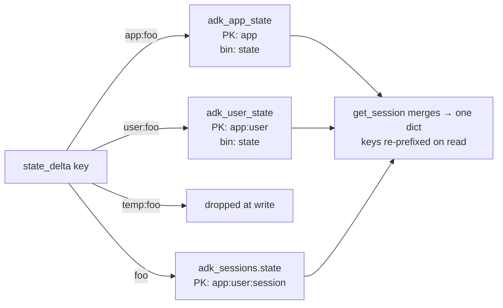
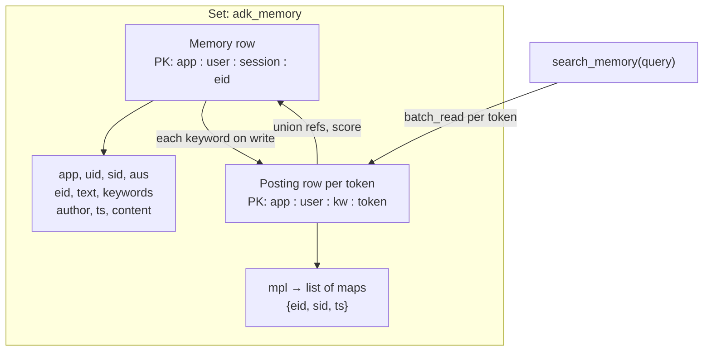
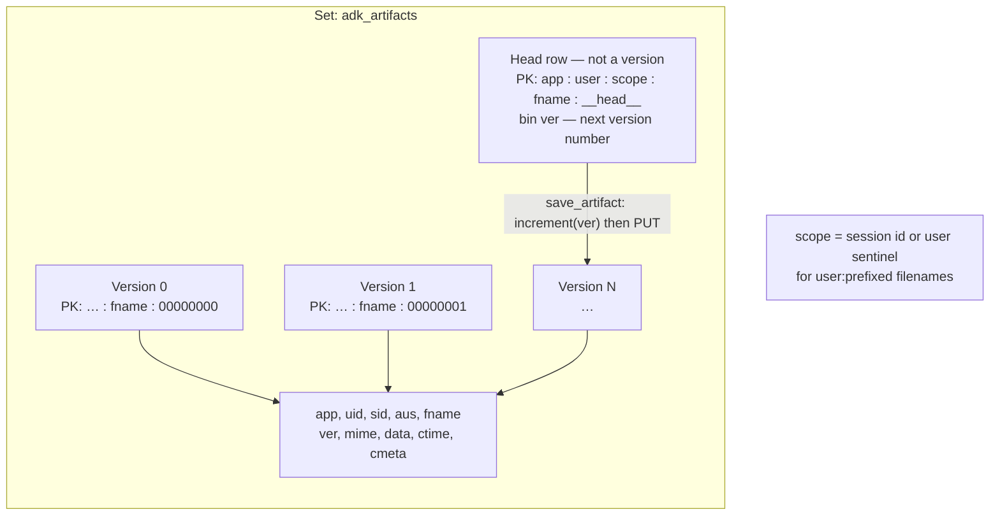
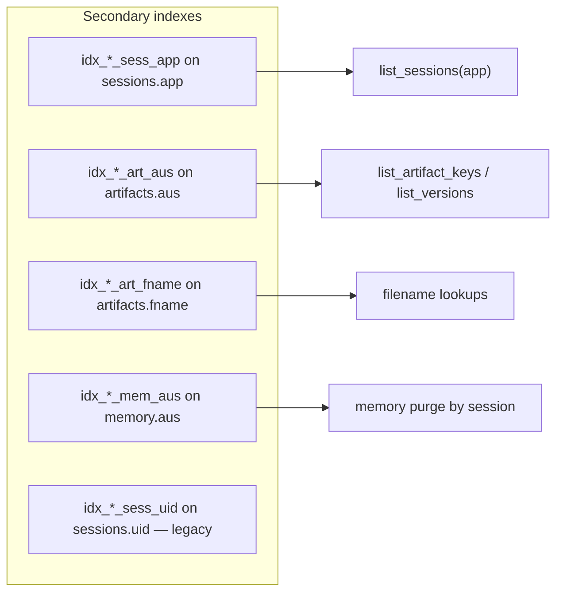

# Aerospike Data Model for ADK

This document fixes the storage layout. Anything that changes here is a breaking
change requiring a major version bump and a migration story.

## Namespace and sets

All data lives in **one Aerospike namespace** chosen by the operator. Within it,
the package uses these sets (default prefix `adk_`, configurable):


| Set              | Primary key                                                                                                            | Purpose                                                         |
| ---------------- | ---------------------------------------------------------------------------------------------------------------------- | --------------------------------------------------------------- |
| `adk_sessions`   | `app : user : session` (session), `app : user : session : c:NNNNNNNN` (chunk), or `app : user : sl` (session manifest) | Session rows, sealed event chunks, and per-user session-id list |
| `adk_app_state`  | `app`                                                                                                                  | App-scoped state (`app:` prefixed keys)                         |
| `adk_user_state` | `app : user`                                                                                                           | User-scoped state (`user:` prefixed keys)                       |
| `adk_artifacts`  | `app : user : session : filename : version:08d`                                                                        | Versioned binary artifacts                                      |
| `adk_memory`     | `app : user : session : event_id` (row) or `app : user : kw : token` (posting)                                         | Memory entries + lexical posting lists                          |


`:` is the field separator. ADK identifiers (`app_name`, `user_id`,
`session_id`, `event_id`) never contain `:` in practice. **Filenames are the
one exception** — the canonical `user:` prefix routes an artifact to a
user-scoped slot (handled in Python by `artifact_scope_id()` *before* key
construction; the `:` ends up inside one field, not as a delimiter). We
never parse keys back into fields — Aerospike hashes the whole string into
a RIPEMD-160 digest — so the `:` inside a filename is invisible at the
storage layer.

## Diagrams

Visual map of everything persisted. Wire names match `schema.py`; PK shapes
match `keys.py`.

### 1. Namespace — five sets




### 2. ADK logical model → storage

What the framework exposes vs where it lives on disk.




### 3. `adk_sessions` — three record kinds, one set




`**list_sessions(app, user)`:** read manifest → bin-projected `batch_read` on
each `app:user:session` (`app`, `uid`, `sid`, `ts` only).

`**list_sessions(app)`** (no user): secondary index on `app` → filter in Python.

### 4. Event storage — chunks + hot tail




**Read path:** `get_session` serves from tail when `num_recent_events` fits;
otherwise walks `c:(chunks-1)…0`, optionally `list_get_by_index_range` per chunk.

**Valid chunk rule:** `c:N` is readable only if `session.chunks > N`.

### 5. Inline event Map (inside `events` List)




### 6. `Session.state` — prefix routing




### 7. `adk_memory` — memory row + posting lists




**Purge:** query `idx_*_mem_aus` where `aus = app:user:session` → delete
memory rows and trim posting lists.

### 8. `adk_artifacts` — versions + head counter




**Listing:** `idx_*_art_aus` on `aus = app:user:scope` (tenant-local hop).

### 9. Secondary indexes (query touchpoints)




No index on `memory.keywords` — search uses posting-list primary keys only.

### 10. Primary-key cheat sheet

```
adk_sessions
  app : user : sl                          manifest (sman)
  app : user : session                     session row
  app : user : session : c : NNNNNNNN      chunk row

adk_app_state
  app                                      state Map

adk_user_state
  app : user                               state Map

adk_artifacts
  app : user : scope : filename : NNNNNNNN version row (scope = sid or "user")
  app : user : scope : filename : __head__ version counter

adk_memory
  app : user : session : event_id          memory row
  app : user : kw : token                  posting row (mpl)
```

---

## Bins

Bin names are kept short (≤14 chars) because Aerospike includes them in every
record. The **canonical definitions** live in code:


| Module                                          | What it defines                                              |
| ----------------------------------------------- | ------------------------------------------------------------ |
| `adk_aerospike._internal.schema.BinName`        | Wire name per bin (`"app"`, `"aus"`, …)                      |
| `adk_aerospike._internal.schema.BIN_REGISTRY`   | Full English name, Aerospike type, sets, record kinds        |
| `adk_aerospike._internal.schema.Bins`           | Same wire names as `BinName` (alias for existing call sites) |
| `adk_aerospike._internal.schema.EventFieldName` | Keys inside each inline event Map                            |
| `adk_aerospike._internal.schema.SET_REGISTRY`   | Set suffixes, primary-key shapes, purpose                    |


Import in Python: `from adk_aerospike._internal.schema import BinName, BIN_REGISTRY`.

### Set glossary

Default prefix `adk_` → full set name `{prefix}{suffix}`.


| Suffix (`StorageSet`) | Full name         | Primary key                                                         | Purpose                                              |
| --------------------- | ----------------- | ------------------------------------------------------------------- | ---------------------------------------------------- |
| `sessions`            | sessions          | `app:user:session`, `app:user:session:c:NNNNNNNN`, or `app:user:sl` | Session rows, chunks, per-user session-id manifest   |
| `app_state`           | application state | `app`                                                               | Shared `app:`‑prefixed state for all users of an app |
| `user_state`          | user state        | `app:user`                                                          | Per-user `user:`‑prefixed state across sessions      |
| `artifacts`           | artifacts         | `app:user:session:filename:version:08d`                             | Versioned binary artifacts                           |
| `memory`              | memory            | `app:user:session:event_id` or `app:user:kw:token`                  | Memory rows + posting-list rows (same set)           |


### Bin glossary (all wire names)


| Wire       | Code (`BinName`)   | Full name                        | Type      | Sets                            | Record kinds                           |
| ---------- | ------------------ | -------------------------------- | --------- | ------------------------------- | -------------------------------------- |
| `app`      | `APP_NAME`         | application name                 | string    | sessions, artifacts, memory     | session, artifact, memory              |
| `uid`      | `USER_ID`          | user identifier                  | string    | sessions, artifacts, memory     | session, artifact, memory              |
| `sid`      | `SESSION_ID`       | session identifier               | string    | sessions, artifacts, memory     | session, artifact, memory              |
| `aus`      | `SCOPE_TUPLE`      | application user scope composite | string    | artifacts, memory               | artifact, memory                       |
| `seq`      | `EVENT_SEQ`        | event sequence counter           | int       | sessions                        | session                                |
| `state`    | `STATE`            | state map                        | Map       | sessions, app_state, user_state | session, app_state_row, user_state_row |
| `ts`       | `TIMESTAMP`        | timestamp                        | float     | sessions, memory                | session, memory                        |
| `events`   | `EVENTS`           | events list                      | List      | sessions                        | session, chunk                         |
| `chunks`   | `CHUNKS`           | sealed chunk count               | int       | sessions                        | session                                |
| `tbytes`   | `TAIL_BYTES`       | tail byte estimate               | int       | sessions                        | session                                |
| `cidx`     | `CHUNK_IDX`        | chunk index                      | int       | sessions                        | chunk                                  |
| `ts_lo`    | `TS_LO`            | chunk first-event timestamp      | float     | sessions                        | chunk                                  |
| `ts_hi`    | `TS_HI`            | chunk last-event timestamp       | float     | sessions                        | chunk                                  |
| `fname`    | `FILENAME`         | artifact filename                | string    | artifacts                       | artifact                               |
| `ver`      | `VERSION`          | artifact version number          | int       | artifacts                       | artifact                               |
| `mime`     | `MIME_TYPE`        | MIME type                        | string    | artifacts                       | artifact                               |
| `data`     | `DATA`             | artifact payload                 | bytes     | artifacts                       | artifact                               |
| `ctime`    | `CREATE_TIME`      | creation time                    | float     | artifacts                       | artifact                               |
| `cmeta`    | `CUSTOM_META`      | custom metadata                  | Map       | artifacts                       | artifact                               |
| `eid`      | `EVENT_ID`         | event identifier                 | string    | memory                          | memory                                 |
| `text`     | `TEXT`             | extracted plain text             | string    | memory                          | memory                                 |
| `keywords` | `KEYWORDS`         | search keywords                  | list[str] | memory                          | memory row (posting-list maintenance)  |
| `mpl`      | `MEM_POSTINGS`     | memory posting list              | list[map] | memory                          | posting row only (`app:user:kw:token`) |
| `sman`     | `SESSION_MANIFEST` | session id manifest              | list[str] | sessions                        | manifest row only (`app:user:sl`)      |
| `author`   | `AUTHOR`           | event author                     | string    | memory                          | memory                                 |
| `content`  | `CONTENT`          | event content                    | Map       | memory                          | memory                                 |


`**aus` (application user scope composite):** wire value
`"{app_name}:{user_id}:{scope_id}"` from `keys.scope_tuple()`. For artifacts,
`scope_id` is the session id or the `"user"` sentinel for `user:`‑prefixed
filenames. Sec-indexed so tenant-scoped queries (`list_artifact_keys`,
`list_versions`, memory purge) hit one slot in a single hop.

`**sid` on artifacts:** session id, or `"user"` for user-scoped artifacts
(same constraint as upstream `InMemoryArtifactService`).

Chunk records **omit** `app`, `uid`, and `sid` so they are not confused with
session rows. `**list_sessions` does not use those indexes** when `user_id` is
set (see below).

### Inline event Map fields (inside `events` List)

Not Aerospike bins — keys within each List element. Defined by
`EventFieldName` / `EVENT_FIELD_REGISTRY` in `schema.py`.


| Wire      | Code             | Full name            | Type   | ADK field                         |
| --------- | ---------------- | -------------------- | ------ | --------------------------------- |
| `_v`      | `SCHEMA_VERSION` | event schema version | int    | (storage-only; current value `1`) |
| `eid`     | `EVENT_ID`       | event identifier     | string | `Event.id`                        |
| `ts`      | `TIMESTAMP`      | event timestamp      | float  | `Event.timestamp`                 |
| `author`  | `AUTHOR`         | event author         | string | `Event.author`                    |
| `content` | `CONTENT`        | event content        | Map    | `Event.content`                   |
| `actions` | `ACTIONS`        | event actions        | Map    | `Event.actions`                   |
| `branch`  | `BRANCH`         | branch label         | string | `Event.branch`                    |


`actions` and `branch` exist only on inline event Maps, not as top-level bins.

---

### `adk_sessions` — session record


| Bin      | Type  | Notes                                                         |
| -------- | ----- | ------------------------------------------------------------- |
| `app`    | str   | denormalised for index queries                                |
| `uid`    | str   | denormalised                                                  |
| `sid`    | str   | denormalised                                                  |
| `state`  | Map   | session-scoped state; updated via Map CDT                     |
| `events` | List  | hot tail of recent events (each item is a Map — see below)    |
| `ts`     | float | last update time (epoch seconds)                              |
| `seq`    | int   | monotonic counter — total events ever appended                |
| `chunks` | int   | number of sealed chunk records (== next chunk index to write) |
| `tbytes` | int   | estimated size of the tail; flush trigger                     |


### `adk_artifacts`


| Bin     | Type  | Notes                                                            |
| ------- | ----- | ---------------------------------------------------------------- |
| `app`   | str   | denormalised                                                     |
| `uid`   | str   | denormalised                                                     |
| `sid`   | str   | session id (or `"user"` sentinel for `user:`-prefixed filenames) |
| `aus`   | str   | composite `app:user:sid` — sec-indexed for tenant-local listing  |
| `fname` | str   | filename (may contain `:`)                                       |
| `ver`   | int   | version number                                                   |
| `mime`  | str   | MIME type                                                        |
| `data`  | bytes | payload                                                          |
| `ctime` | float | creation time                                                    |
| `cmeta` | Map   | custom metadata                                                  |


### `adk_memory`


| Bin        | Type      | Notes                                                     |
| ---------- | --------- | --------------------------------------------------------- |
| `app`      | str       | denormalised                                              |
| `uid`      | str       | denormalised                                              |
| `sid`      | str       | session id                                                |
| `aus`      | str       | composite `app:user:sid` — sec-indexed for purge          |
| `eid`      | str       | event id                                                  |
| `text`     | str       | extracted text content                                    |
| `keywords` | list[str] | tokenized terms; drives posting-list maintenance on write |
| `author`   | str       | event author                                              |
| `ts`       | float     | event timestamp                                           |
| `content`  | Map       | full event content (for reconstruction)                   |


**Posting rows** share the `adk_memory` set but use primary keys
`app:user:kw:<token>` (see `keys.memory_posting_key`). `search_memory` does
`batch_read` on those keys (one per query token), unions candidate event refs,
then `batch_read` on the memory rows — no list-element secondary index on search.

**Memory row** keys remain `app:user:session:event_id`.

### `adk_memory` — posting row (key infix `:kw:`)


| Bin   | Type      | Notes                                     |
| ----- | --------- | ----------------------------------------- |
| `mpl` | list[map] | `{eid, sid, ts}` refs for one query token |


Primary key: `app:user:kw:<token>`. List is trimmed server-side when it exceeds
2048 entries (oldest refs dropped).

### `adk_artifacts` — version head (suffix `:__head__`)

Sibling record per `(app, user, session, filename)` holding the next version
number. `save_artifact` uses atomic `increment(ver)` on this key — not a stored
artifact version row. See `keys.artifact_head_key`.

### `adk_sessions` — chunk record (key suffix `: c:NNNNNNNN`)


| Bin      | Type  | Notes                                                              |
| -------- | ----- | ------------------------------------------------------------------ |
| `cidx`   | int   | chunk index — also serves as discriminator (session has no `cidx`) |
| `events` | List  | sealed (immutable) batch of events                                 |
| `ts_lo`  | float | timestamp of first event in chunk — `after_timestamp` pruning      |
| `ts_hi`  | float | timestamp of last event in chunk                                   |


Chunks deliberately **omit `app`/`uid`/`sid` bins** so they are never listed as
sessions.

### `adk_sessions` — session manifest (key suffix `:sl`)


| Bin    | Type      | Notes                                      |
| ------ | --------- | ------------------------------------------ |
| `sman` | list[str] | Session ids for this `(app_name, user_id)` |


Primary key: `app:user:sl` (`keys.session_manifest_key`). **Not a session row.**

- `**create_session`** appends `sid` to `sman` via `list_append`.
- `**delete_session**` removes `sid` from `sman`.
- `**list_sessions(app, user)**` — `GET` manifest, then **bin-projected**
`batch_read` on each session PK (`app`, `uid`, `sid`, `ts` only — no
`events` or `state`). Stale manifest entries (missing session row) are
removed on read.

`list_sessions(app)` **without** `user_id` still queries `idx_*_sess_app` and
filters in Python (cold path).

### Event item shape (inside the `events` List)


| Map key   | Type  | Notes                                        |
| --------- | ----- | -------------------------------------------- |
| `eid`     | str   | `Event.id`                                   |
| `ts`      | float | event timestamp                              |
| `author`  | str   | agent name / "user"                          |
| `content` | Map   | `genai_types.Content` projected via Pydantic |
| `actions` | Map   | `EventActions` projected via Pydantic        |
| `branch`  | str   | optional branch label                        |


## Chunking & flush triggers

- **Default flush threshold:** 256 KiB (¼ of Aerospike `write-block-size`).
When `tbytes >= 256 KiB` after an append, the tail is flushed to a chunk
record at `c:chunks`, the tail is cleared, and `chunks` is incremented.
- **Huge single event:** if an individual event exceeds 900 KiB, it is
pre-flushed (current tail sealed first) and then placed in its own fresh
tail so it doesn't combine with other events into an over-large record.
- **Both thresholds configurable** via `AerospikeSessionService(..., flush_threshold_bytes=..., huge_event_bytes=...)`.

## Atomicity & crash safety

Fast-path append is a **single server-side atomic `operate()`** on the session
record (`list_append + increment(seq) + increment(tbytes) + map_put_items(state) + write(ts)`).
No MRT required.

Flush is two ops: PUT the chunk record (overwriting any orphan from a prior
interrupted flush), then a generation-checked `operate()` to clear the tail
and bump `chunks`. **Invariant:** chunk record `c:N` is *valid* only when
`session.chunks > N`. Any chunk at `cidx >= session.chunks` is an orphan that
readers ignore and that the next successful flush overwrites — no data loss
because the tail still holds the events until the gen-checked reset commits.

## Secondary indexes

Required for the operations below; create on first connect (idempotent).


| Index name              | Set             | Bin     | Type   | Used by                                                                             |
| ----------------------- | --------------- | ------- | ------ | ----------------------------------------------------------------------------------- |
| `idx_<prefix>sess_uid`  | `adk_sessions`  | `uid`   | string | Legacy / unused for `list_sessions(app, user)` — prefer manifest                    |
| `idx_<prefix>sess_app`  | `adk_sessions`  | `app`   | string | `list_sessions(app_name=…)` only (no `user_id`)                                     |
| `idx_<prefix>art_aus`   | `adk_artifacts` | `aus`   | string | `list_artifact_keys` / `list_versions` / `load_artifact` (composite app:user:scope) |
| `idx_<prefix>art_fname` | `adk_artifacts` | `fname` | string | direct filename lookups (kept for completeness)                                     |
| `idx_<prefix>mem_aus`   | `adk_memory`    | `aus`   | string | `add_session_to_memory` purge step (composite app:user:session)                     |


**Composite tenant indexes (`aus` = "app:user:scope")** are the load-bearing
ones for artifacts and memory. They narrow secondary-index queries to a single
tenant slot in a single hop, so a multi-tenant install doesn't pay a scan
proportional to total cluster traffic just to list one user's artifacts. The
`fname` / `uid` indexes alone would force a sec-index-then-Python-filter
pattern with scan amplification linear in unrelated tenants' data.

## State scoping (`app:` / `user:` / `temp:` prefixes)

ADK's `Session.state` is a single dict, but key prefixes route to different
scopes:

- `app:foo` → routed to `adk_app_state` row keyed by `app_name`, bin `state`
- `user:foo` → routed to `adk_user_state` row keyed by `(app_name, user_id)`
- `temp:foo` → never persisted; lives in process memory only
- *(unprefixed)* `foo` → stays in `adk_sessions.state` for this session

When `get_session` rehydrates, it merges all four scopes into one `state` dict.
When `append_event` applies a `state_delta`, the delta is partitioned by prefix
and each piece goes to its corresponding set via a Map CDT operation.

## Memory (core Aerospike, lexical)

Memory lives in `adk_memory`. Search is **lexical word-overlap** — same
semantics as ADK's `InMemoryMemoryService` — via **posting-list primary keys**
(`app:user:kw:<token>`). No embeddings, no embedder dependency.


| Record kind | Primary key                 | Purpose                          |
| ----------- | --------------------------- | -------------------------------- |
| Memory row  | `app:user:session:event_id` | Full entry (text, content, …)    |
| Posting row | `app:user:kw:<token>`       | Inverted index of `{eid,sid,ts}` |


`idx_<prefix>mem_aus` on memory rows supports session purge only (see
[Secondary indexes](#secondary-indexes)). There is **no** secondary index on
`keywords` for search.

`search_memory(app_name, user_id, query)`:

1. Tokenize query in Python (lowercase `[A-Za-z]+`, dedup).
2. `batch_read` one posting row per query token.
3. Union `{eid,sid,ts}` refs client-side; score by token-overlap count.
4. `batch_read` matching memory rows (cap 512 candidates before hydrate).
5. Return top-k as `SearchMemoryResponse`.

`add_session_to_memory` writes one memory row per text-bearing event and appends
each keyword's ref to that token's posting list.

For stemming, partial match, or multi-language ranking, use the
[Elasticsearch connector](https://aerospike.com/blog/build-full-text-search-applications-on-aerospike-using-elasticsearch/)
(out of scope here).

## Record-size considerations

- Aerospike default `write-block-size` is 1 MiB. Sessions with very long state
Maps may exceed this — keep state small, push large blobs to artifacts.
- Artifacts are capped at the same `write-block-size`. For larger artifacts,
store an S3/GCS reference instead of inline bytes (planned, not v0.0.1).

## Strong consistency vs AP

Works in both. Because events live inline on the session record (chunked when
large), `append_event` is a single-record atomic `operate()` regardless of
namespace consistency mode — no MRT required for the hot path. Flush is
two ops with optimistic gen-check; the invariant above makes it crash-safe in
either mode.

App/user state updates are independent single-record operates on their own
records; they are not atomic with the session-record append, but ADK's
contract permits this (DatabaseSessionService doesn't make that guarantee
either).